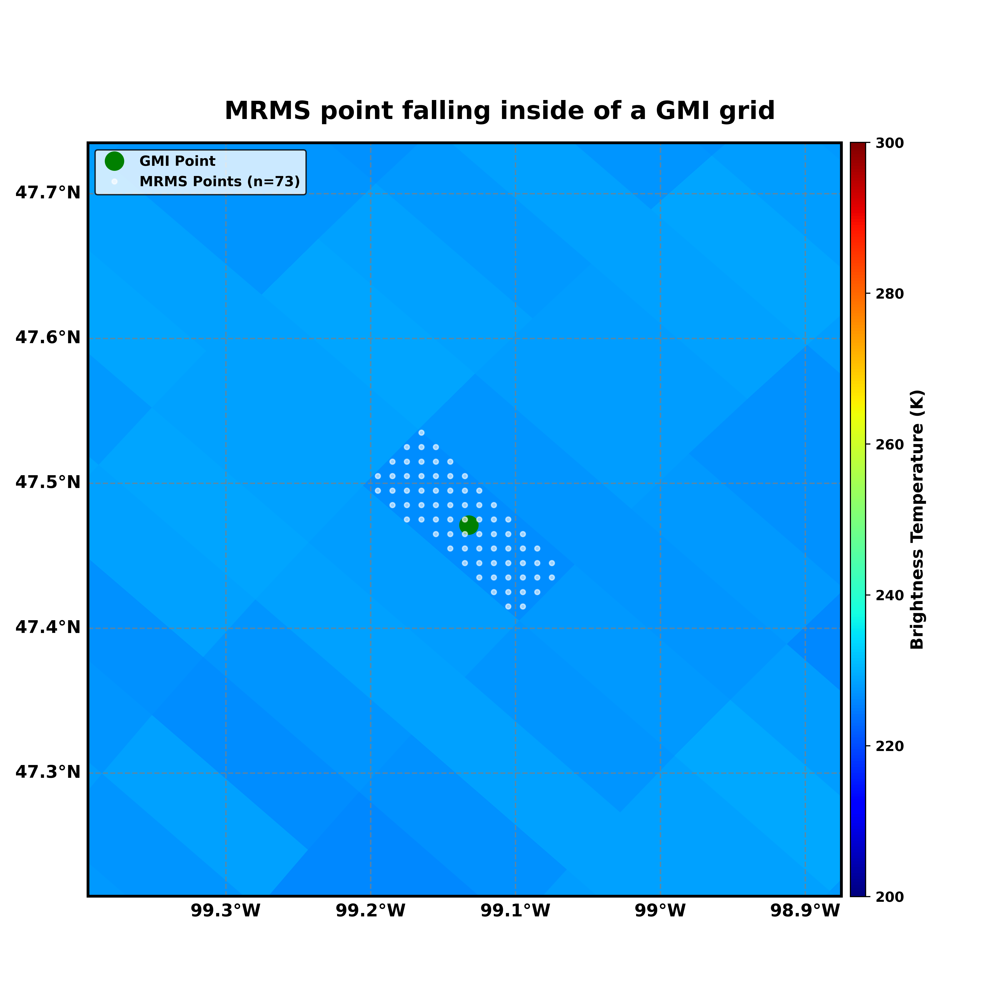
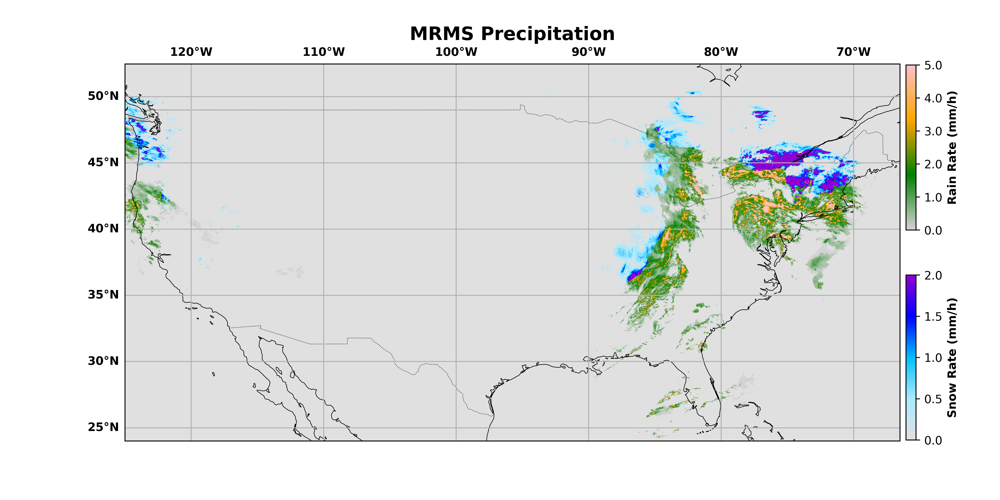
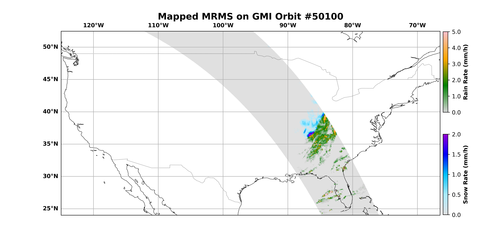

# MRMS Precipitation Data Mapped on GMI Orbits

## 1. Overview

This repository contains Multi-Radar Multi-Sensor (MRMS) 2-minute precipitation data that has been spatially and temporally mapped onto Global Precipitation Measurement (GPM) Microwave Imager (GMI) orbits crossing the Continental United States (CONUS). The dataset is organized into two folders:

- **Flag Folder**: Contains precipitation type classification data (Rain = 1, Snow = 2, clear = 0, no coverage = -3, outside of CONUS = NAN)
- **Rate Folder**: Contains precipitation rate data in mm/hr

## 2. The Method

The mapping process followed these steps:

1. Created a 3-dimensional Python list to handle the spatial-temporal matching of corresponding GMI files crossing CONUS with corresponding MRMS filenames.

2. Developed an algorithm for approximately finding MRMS points falling inside of GMI grids:
   - For each MRMS point, we identified the nearest GMI point
   - Then assigned all MRMS points to the GMI point that was nearest to them
   
   
   
3. To prevent gathering MRMS points outside of the GMI orbit:
   - Created fake padding at the edges of the GMI orbit
   - Processed the spatial mapping with this padding in place
   - Removed the padding after implementation of the spatial mapping was complete
   

## 3. A Sample

Below are sample visualizations of the data:

<table>
  <tr>
    <th>Original MRMS Data</th>
    <th>Mapped on GMI Orbit</th>
  </tr>
  <tr>
    <td></td>
    <td></td>
  </tr>
  <tr>
    <td align="center">2022/12/23 at 04:04:00</td>
    <td align="center">GMI Orbit 50100 (04:02:00 - 04:10:00, 2022/12/23)</td>
  </tr>
</table>

The left figure displays the original MRMS data from December 23, 2022, at 04:04:00 UTC, and the right one presents the
mapped data on GMI orbit number 50100, which crossed CONUS between 04:02:00 and 04:10:00 UTC on the same
day.
